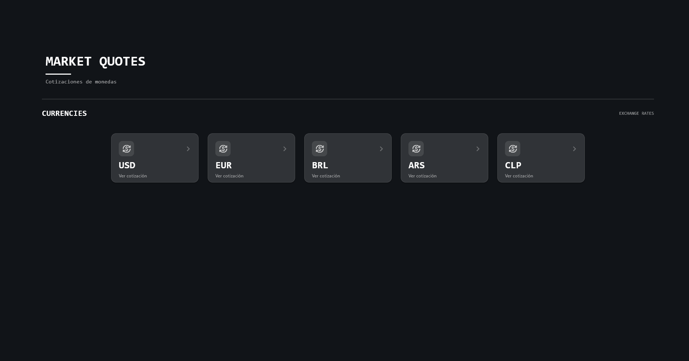
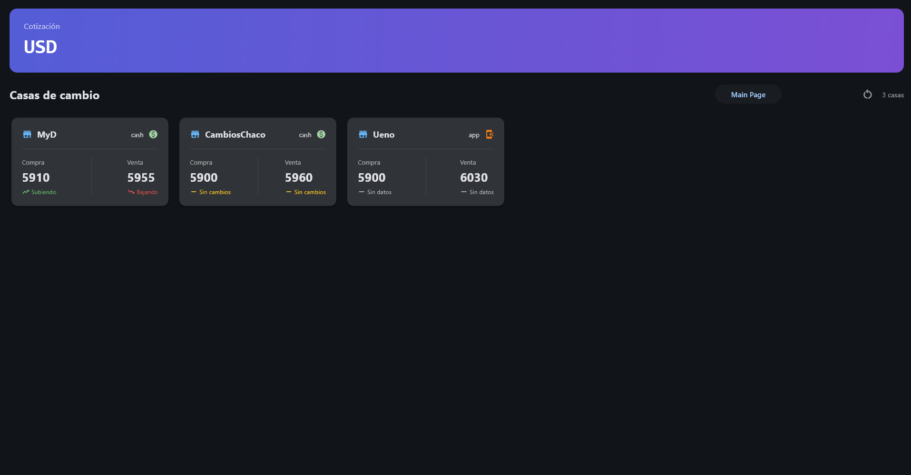

# Cotization App

Desktop application for monitoring currency exchange rates from different exchange houses.

The application collects, processes and displays currency quotations in a centralized interface, allowing users to compare buying and selling rates between different exchange houses.

### Origin / Date

Im building this while im 16 years old, 07 / 25 / 07

## Purpose

This project was created as a practical application of Python software development concepts, including modular architecture, data modeling, web scraping, service separation and desktop UI development. I originally created this project because of my Dad who need constantly to view the Dollar currencies etc, he has some sort of Autism and TDAH so i wanted to relief him of some stress...


## Features

* 📊 Display currency exchange rates
* 🏦 Compare quotations between different exchange houses
* 🔄 Retrieve updated market data
* 📈 Display buying and selling trends
* 🧩 Modular scraper architecture
* 🖥️ Desktop interface built with Flet
* 💾 Local data storage
* 🏗️ Separation between UI, services, models and data collection

## Architecture

The project is organized into different layers:

```text
app/
├── assets/
├── data/
├── models/
├── scrapers/
├── services/
└── ui/
```

### Models

Contains the application's data models, such as currencies, exchange types and market trends.

### Scrapers

Responsible for obtaining exchange-rate information from different exchange houses.

Each scraper is isolated from the rest of the application, making it easier to add support for new sources.

### Services

Contains the application's business logic and data-processing operations.

### UI

Contains the Flet interface and the different views used to display the information.

### Data

Contains locally stored application data.

## Technologies

* Python
* Flet
* Web scraping
* JSON
* Git / GitHub

## Getting Started

### 1. Clone the repository

```bash
git clone https://github.com/pokimaster360/Cotization-App.git
cd Cotization-App
```

### 2. Create a virtual environment

Windows:

```powershell
python -m venv .venv
.venv\Scripts\activate
```

Linux / macOS:

```bash
python3 -m venv .venv
source .venv/bin/activate
```

### 3. Install dependencies

```bash
pip install -r requirements.txt
```

### 4. Run the application

```bash
python main.py
```

## Project Structure

```text
Cotization-App/
│
├── app/
│   ├── assets/       # Application assets
│   ├── data/         # Local application data
│   ├── models/       # Data models
│   ├── scrapers/     # Exchange-house scrapers
│   ├── services/     # Business logic
│   └── ui/           # Flet interface
│
├── images/           # Screenshots and visual resources
├── main.py           # Application entry point
├── requirements.txt  # Python dependencies
├── .gitignore
└── README.md
```


                 ┌──────────────┐
                 │ Exchange     │
                 │ Houses       │
                 └──────┬───────┘
                        │
                        ▼
                 ┌──────────────┐
                 │   Scrapers   │
                 └──────┬───────┘
                        │
                        ▼
                 ┌──────────────┐
                 │   Services   │
                 └──────┬───────┘
                        │
                        ▼
                 ┌──────────────┐
                 │    Models    │
                 └──────┬───────┘
                        │
                        ▼
                 ┌──────────────┐
                 │     UI       │
                 │    (Flet)    │
                 └──────────────┘


## Status

🚧 Active development


## Screenshots

### Main Page



### Currency Details

